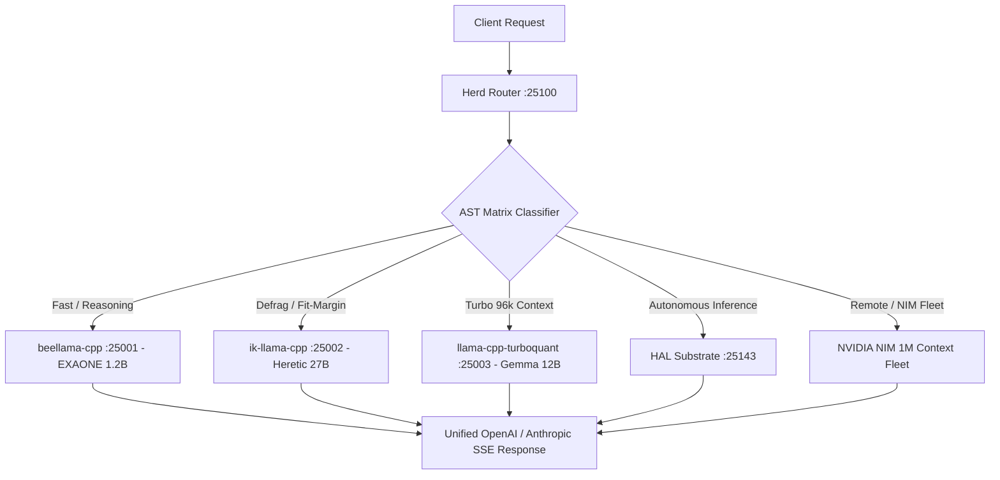

# Herd (llama-swap)

> **Orchestrate fleets of LLM inference engines. Zero downtime, zero friction.**  
> Canonical Lineage: **[toxicwind/herd](https://github.com/toxicwind/herd)** & **[toxicwind/llama-swap](https://github.com/toxicwind/llama-swap)** (Upstream: [mostlygeek/llama-swap](https://github.com/mostlygeek/llama-swap))

[](https://github.com/toxicwind/herd/actions)
[](https://github.com/toxicwind/herd/actions)
[](./LICENSE.md)

---

## 🔱 Sovereign Fleet Orchestration (75 Models via AST Matrix)

Herd is the high-performance inference gateway and model router for the Sovereign Stack. It transforms single-model hot-swapping into multi-tier fleet orchestration across local hardware (NVIDIA RTX 3090 24GB CUDA 8.6 + AMD Ryzen 7 8700F Zen 4 AVX-512) and remote endpoints.

### Core Capabilities Matrix

| Capability | Standard Hot-Swap | Herd Sovereign Orchestrator |
|---|---|---|
| **Model Fleet** | 1 model active | **75 models routed via AST Matrix** |
| **Connection Handling** | Drop connection on swap | **Zero-downtime SSE keep-alive** |
| **Hardware Offload** | Unmanaged CPU/GPU | **CUDA 8.6 Flash-Attn + Zen 4 AVX-512** |
| **API Endpoints** | OpenAI basic | **OpenAI, Anthropic, Ollama, SDAPI, Rerank, Voice** |
| **Supervisor Integration** | Standalone process | **Pitchfork-LLM & Sovereign Control Plane (:25100)** |
| **Observability** | CLI logs | **Prometheus Metrics (:25105) + SSE Event Stream** |

---

## 🚀 Architecture & Routing



---

## 🛠️ API & Feature Reference

- ✅ **Full Multi-Format API Support**:
  - `v1/chat/completions`, `v1/completions`, `v1/responses`
  - `v1/messages` (Anthropic Messages API with prompt caching preservation)
  - `v1/embeddings`, `v1/rerank`, `v1/reranking`
  - `v1/audio/speech`, `v1/audio/transcriptions`, `v1/audio/voices`
  - `v1/images/generations`, `v1/images/edits` (SDAPI via stable-diffusion.cpp)
- ✅ **Dynamic Management & Observability**:
  - `GET /health` -> `OK`
  - `GET /metrics` -> Prometheus metrics for memory, active model state, request rates
  - `GET /running` -> Active running models and memory allocations
  - `POST /api/models/unload` & `POST /api/models/unload/:model_id`
  - `GET /logs/stream` & `GET /models/sse` -> Live SSE event streams for editor integration (Zed / QED)

---

## 📦 Build & Run

```bash
# Build with Zen 4 AVX-512 and maximal Go compiler flags
go build -v -ldflags="-s -w" -o llama-swap ./cmd
./llama-swap --config /home/toxic/sovereign/config/llama-swap.yaml
```
